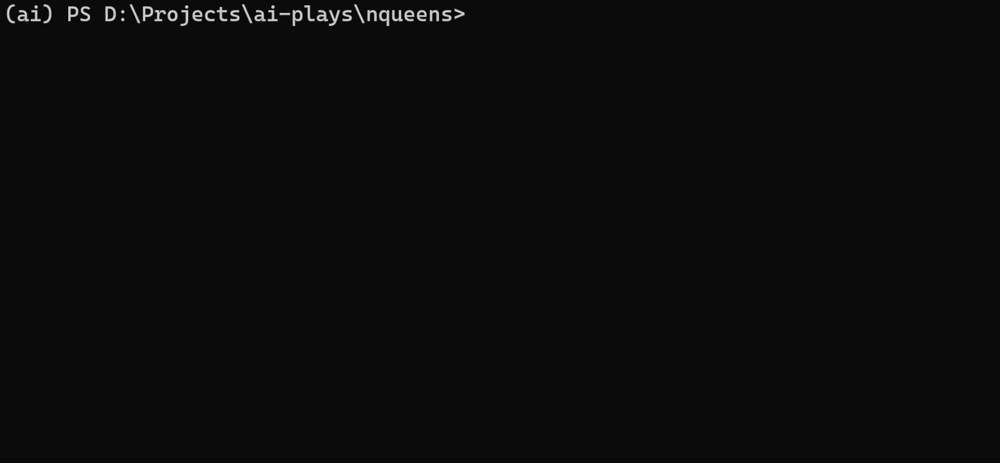
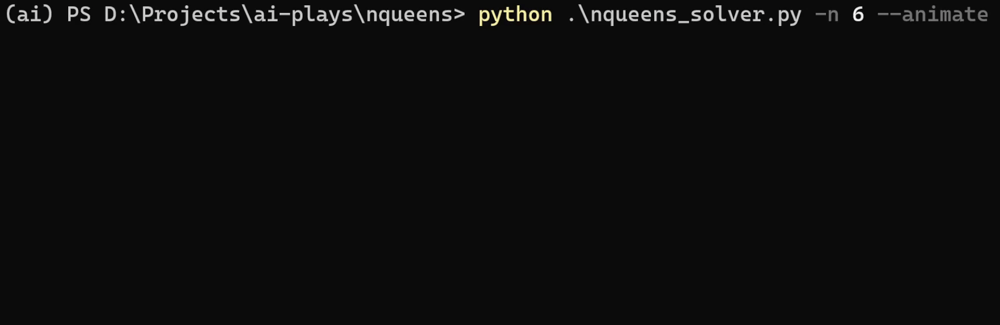

# AI Plays

This repository is a collection various AI algorithms for building a bot that can play simple games or solve foundational problems. This repository is like my workspace for AI as I learn to implement various Classical AI algorithms and applying (Deep) Reinforcement Learning algorithms on those problems.

## Usage

### Play TicTacToe Game

Run the [tictactoe.py](tictactoe/tictactoe.py) script to play the game with 2 human players.

```bash
cd tictactoe
python tictactoe.py
```

### Solve a CSP (NQueens) using Backtracking

Run the [nqueens_solver.py](nqueens/nqueens_solver.py) script to solve NQueens with Backtracking.

```bash
usage: nqueens_solver.py [-h] [-n NQUEENS] [--animate]

Solves the NQueens Problem using Backtracking

optional arguments:
  -h, --help            show this help message and exit
  -n NQUEENS, --nqueens NQUEENS
                        Number of queens. Default is 6.
  --animate             Use this flag to animate the backtracking process as it explores and places the queens on the board.
```

#### How to Run Normally

To run the solver normally,

```bash
cd nqueens
python nqueens_solver.py -n 8
```



#### How to Run with Animation

To run it with a live animation of backtracking,

```bash
cd nqueens
python nqueens_solver.py -n 8 --animate
```



## TODO

A checklist of things to do in this repository.

- [x] Code a Normal 2 Player TicTacToe Terminal Game
- [x] Solving Constraint Satisfaction Problems (NQueens) using Backtracking
- [ ] Convert the Game to a Gym Environment or a similar Interface so that the AI can interact with it easily.
- [ ] MinMax Algorithm and Self-Play
- [ ] NeuroEvolution
- [ ] Classical Q Learning
- [ ] Deep Q Learning
- [ ] AlphaZero with Monte Carlo Tree Search (MCTS)
- [ ] MuZero
