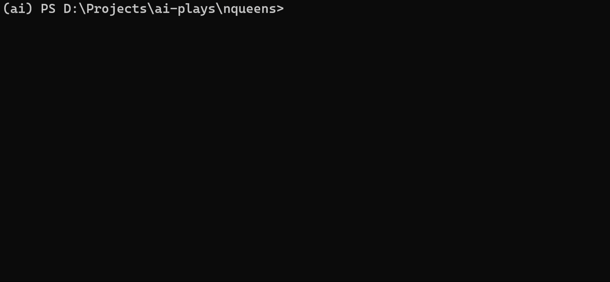
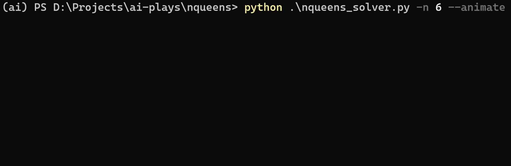

# Solve a CSP (NQueens) using Backtracking

This is an implementation of Backtracking (DFS) to solve a Constraint Satisfaction Problem, like N-Queens as implemented here. Execute the [nqueens_solver.py](nqueens_solver.py) script to solve NQueens problem with Backtracking.

## How to Run (Normally)

To run the solver normally,

```bash
python nqueens_solver.py -n 12
```



## How to Run (with Animation)

To run it with a live animation of backtracking,

```bash
python nqueens_solver.py -n 6 --animate
```



## Arguments Reference

```bash
usage: nqueens_solver.py [-h] [-n NQUEENS] [--animate]

Solves the NQueens Problem using Backtracking

optional arguments:
  -h, --help            show this help message and exit
  -n NQUEENS, --nqueens NQUEENS
                        Number of queens. Default is 6.
  --animate             Use this flag to animate the backtracking process as it explores and places the queens on the board.
```
